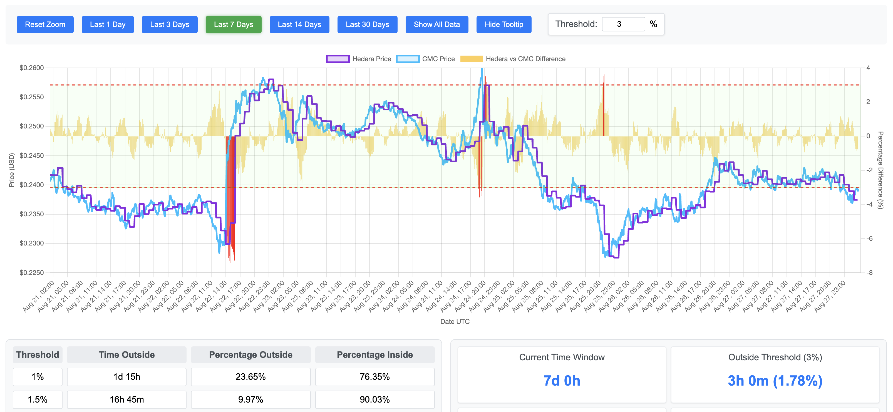

# Hedera HBAR Exchange Rate Oracle Analysis



The Hedera HBAR Exchange Rate Oracle Analysis repo contains an interactive chart serving especially as data analysis and support for the discussion around the Hedera Improvement Proposal [HIP-1264: Dollar-denominated values](https://github.com/hiero-ledger/hiero-improvement-proposals/pull/1264).

Or, you can just be here to play with the [live interactive chart](https://internetofpeers.org/hedera-hbar-exchange-rate-oracle-analysis/release).

## Update the data

The interactive chart is a static HTML page. It contains a static compressed version of the CSV data, but you can paste new data and refresh the visualization. Data is managed and displayed in UTC format.

The external references are the [chart.js](https://www.chartjs.org/) library and related plugins, plus the [pako](https://github.com/nodeca/pako) library for decompression. All libraries are minified and included in the `./src/contrib` folder. Compression is made via bash scripts during the data update process.

The `update-chart.sh` script serves as a central point for updating the `index.html` page with fresh data. In particular the script:

1. Fetches the latest HBAR price data from [CoinMarketCap](https://coinmarketcap.com/currencies/hedera/) (1 day with 5 mins interval + 10 days with 15 mins interval) and update the corresponding `./data/cmc-hbar-prices.csv` file.
2. Fetches the latest HBAR exchange rate using the [Public Hashgraph Mirror Node Exchange Rate APIs](https://mainnet.mirrornode.hedera.com/api/v1/docs/#/network/getNetworkExchangeRate) (rate updated hourly) and update the corresponding `./data/hedera-hbar-prices.csv` file.
3. Fills the missing data points for the Hedera Exchange Rate vs CMC and merges the two files into the temporary file `./build/uncompressed-hbar-prices.csv`. You can copy & paste this data into the chart directly, if you want.
4. Compress the merged data, update the `./src/index.html` page, and copy all the updated resources into the `./release` folder.

The `data` folder contains data already downloaded and processed. Considering it's immutable, I prefer to keep a version in the repo, but if you want you can simply remove those files and start from scratch. By default, the scripts will take the last 10 days of data.

## Execution example without any existing data

```bash
❯ ./scripts/update-chart.sh
[2025-08-27 00:26:38:999600000] CMC - Fetching data... Done.
[2025-08-27 00:26:39:635726000] CMC - Merging data... Done.
[2025-08-27 00:26:39:707834000] CMC - Check duplicates... Done.
[2025-08-27 00:26:39:782367000] HEDERA - INFO: Existing data file not found, using fallback timestamp
[2025-08-27 00:26:39:817148000] HEDERA - Starting HBAR price collection
[2025-08-27 00:26:39:840598000] HEDERA - Start: 2025-08-16T22:00:00Z, End: 2025-08-26T22:00:00Z
[2025-08-27 00:26:39:848849000] HEDERA - Initialized temporary CSV file: /var/folders/5r/073xbzsn56bf0tcfd9rkr2x00000gp/T/tmp.v7EHvYNC5e
[2025-08-27 00:26:39:857439000] HEDERA - Processing approximately 10 days of data...
[2025-08-27 00:26:39:873938000] HEDERA - Starting from timestamp: 1755381600 (2025-08-16T22:00:00Z)
[2025-08-27 00:26:58:041631000] HEDERA - Progress: 100 requests completed, 200 records saved, currently at: 2025-08-25T06:00:00Z
[2025-08-27 00:27:01:648668000] HEDERA - Initial collection completed!
[2025-08-27 00:27:01:658772000] HEDERA - Total requests: 120
[2025-08-27 00:27:01:668662000] HEDERA - Failed requests: 0
[2025-08-27 00:27:01:677630000] HEDERA - Total records saved: 240
[2025-08-27 00:27:01:769884000] HEDERA - Starting missing data analysis and filling process
[2025-08-27 00:27:01:778424000] HEDERA - CSV file: ./scripts/../data/hedera-hbar-prices.csv
[2025-08-27 00:27:01:805494000] HEDERA - Created temporary backup: /var/folders/5r/073xbzsn56bf0tcfd9rkr2x00000gp/T/tmp.nZQIwMLPtT
[2025-08-27 00:27:01:823528000] HEDERA - Analyzing CSV file for missing hours: ./scripts/../data/hedera-hbar-prices.csv
[2025-08-27 00:27:01:882239000] HEDERA - Data range: 2025-08-16T23:00:00Z to 2025-08-26T22:00:00Z
[2025-08-27 00:27:03:832710000] HEDERA - Found 1 missing hours
[2025-08-27 00:27:03:842192000] HEDERA - Missing timestamps:
[2025-08-27 00:27:03:859943000] HEDERA -   1755712800 (2025-08-20T18:00:00Z)
[2025-08-27 00:27:03:895263000] HEDERA - Filling 1 missing hours...
[2025-08-27 00:27:03:912595000] HEDERA - Fetching data for missing timestamp: 1755712800 (2025-08-20T18:00:00Z)
[2025-08-27 00:27:04:090685000] HEDERA - ✓ Filled data for 2025-08-20T18:00:00Z
[2025-08-27 00:27:04:212897000] HEDERA - Successfully filled: 1, Failed: 0
[2025-08-27 00:27:04:222970000] HEDERA - Merging new data with existing CSV...
[2025-08-27 00:27:04:257468000] HEDERA - Successfully updated CSV file with 1 new records
[2025-08-27 00:27:04:291208000] HEDERA - Process completed successfully
[2025-08-27 00:27:04:333914000] MERGER - Reading Hedera CSV file... Done. Loaded 240 Hedera price points
[2025-08-27 00:27:04:371924000] MERGER - Reading CMC CSV file... Done. Loaded 1665 CMC price points
[2025-08-27 00:27:04:410237000] MERGER - Merging data... Done. Merged 1623 data points
[2025-08-27 00:27:04:464771000] MERGER - Writing merged CSV... Done. Data saved to: ./scripts/../build/uncompressed-hbar-prices.csv
[2025-08-27 00:27:04:493596000] MERGER - Merge completed successfully.
[2025-08-27 00:27:04:555620000] WRITER - Compressing CSV data...Done.
[2025-08-27 00:27:04:574304000] WRITER - Updating HTML file...Done.
```
